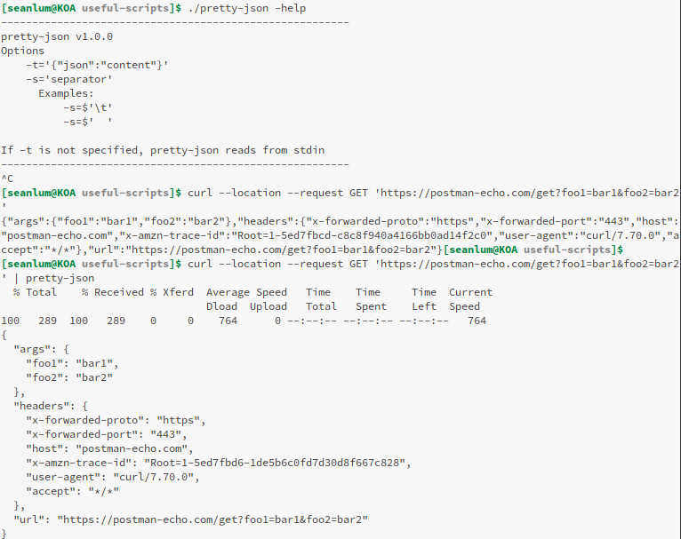

# Command-line Tools

## gen-password
This tool generates passwords in the commandline.

## getfdata
This tool gets some file metadata, and works best with images

 

## howmanydups
This tool compares two files and tells you what is different. The text separation delimiter may be specified.

## pretty-json
This tool takes condensed JSON data (from a REST service or file), and formats it with some available options.

# Web Tools 

## Draw Rectangles (draw-rectangles.html)
Allows you to freely create rectangles on a webpage by clicking, dragging, and releasing the left mouse button. 

## Text Node Search (text-node-search.html)
Allows you to make multiple searches through a web-page with JavaScript Regular Expressions. The script puts the results in bold, and creates `#links` in the page on the content. 

## Load Table (load-table.html)
Allows you to search among all available columns of tabular data

## Draw Heatmap (draw-heatmap.html)
If you drag your mouse through the screen, and then click "Draw heatmap", the web-page will draw squares where your mouse events occurred.

## Binary Converter (binary-converter.html)
A collection of tools I wrote while studying for some computer networking tests. These tools allow you to work with IPv4 network IDs, CIDR notation, subnets, and more. It also has tools for converting base-10 numbers to two's-compliment (binary) numbers, and back again.

